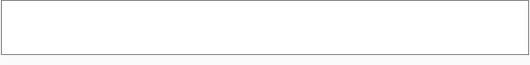

# Taggier

JavaScript object to easing tag and hashtag inputs

See it on action: [Taggier](https://vikcch.github.io/taggier)



Uses comma `,` as the separator

## NPM

`npm install taggier`

HTML:

```html
<div id="example"></div>
```

JavaScript:

```js
import Taggier from 'taggier';

const taggier = new Taggier('example');
```

CSS:

```css
.tag {
    background-color: #ccc;
    padding: 8px 16px;
    cursor: pointer;
    border-radius: 8px;
}

.tag:hover {
    filter: brightness(95%);
    transition: all .1s ease;
}

.tag::after {
    content: ' \00d7';
}

.tag:hover::after {
    color: red;
}
```

## Syntax

`new Taggier(divId|div[, options]);`

## Parameters

`divId` _String_ - The id of the div Element

`div` _HTMLDivElement_ - The div Element

`options` _Object_ - Optional

### Options

Object: Second parameter - Optional

```js
const myOptions = {
    gap: 8,
    hashtag: true
};
const taggier = new Taggier('example', myOptions);
```

`gap` _Number_ - Set the gap in pixels between each tag. Default: `16`

`forbiddenPattern` _Regex | Boolean_ - Forbidden characters. (Set to `false` to have none) Default: `/[^\w]+/g` (Alphanumeric)

`hashtag` _Boolean_ - Is hashtag. Default: `false`

`border` _Boolean_ - If no css for the element is specified a `1px solid gray` will be assign. Default: `true`

`focus` _Boolean_ - Has outline. Default: `true`

## Accessors

`tags` _Array_ - Array of strings beeing each element a tag text.

## Methods

`getTags()` : _Array_ - Returns a new Array of strings beeing each element a tag text.  

`setTags(values)` (_values : Array_) : _void_ - Sets tags beeing each element a tag text.

`addTags(values)` (_values : Array_) : _void_ - Add tags beeing each element a tag text.

`removeAll()` : _void_ - Remove all tags.

`hasPendingText()` : _Boolean_ - Returns `true` if there is any text not tagged.

`pendingText()` : _String_ - Returns the pending text in the element.

`makeTagFromPendingText()` : _void_ - Makes a Tag from pending text in the element.
